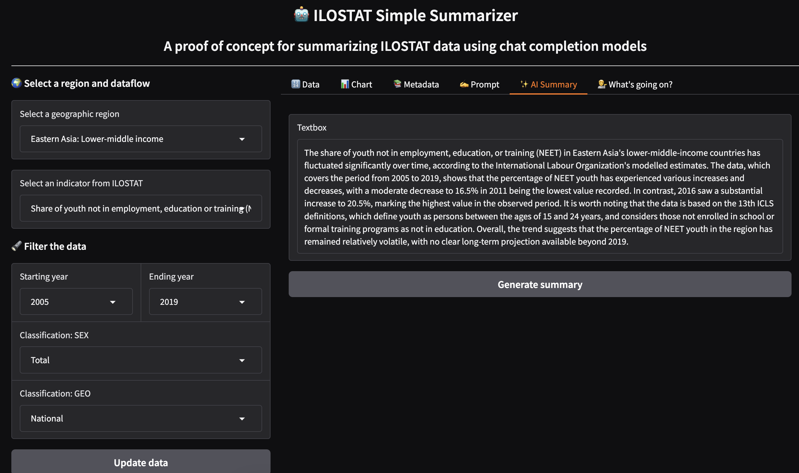

# ILOSTAT Simple Summarizer

A proof of concept for creating natural language descriptions of data returned by the [ILOSTAT SDMX API](https://ilostat.ilo.org/resources/sdmx-tools/) using a chat completion model.



## Usage

Before following either of the steps below, you'll need to get a token from [Hugging Face](https://huggingface.co/).

### Docker Image

The easiest way to run the app locally is to pull the Docker image from the container registry.

```
docker pull ghcr.io/justintemps/ilostat-simple-summarizer/ilostat-simple-summarizer:latest
```

You can then run the container like this:

```
docker run -p 7860:7860 --env HUGGING_FACE_TOKEN=yourhuggingfacetoken ghcr.io/justintemps/ilostat-simple-summarizer/ilostat-simple-summarizer:latest
```

The application should be available at http://127.0.0.1:7860

### From source code

#### Install dependencies

`pip install -r requirements.txt`

#### Add .env file

Create an `.env` file in the project root with your personal Hugging Face token.

```
HUGGING_FACE_TOKEN=yourhuggingfacetoken
```

#### Start application

`python3 main.py`

The first time you run this command, the app will cache certain metadata from the ILOSTAT SDMX API. This may take a while.

After that, the application should start on local url http://127.0.0.1:7860

## How it works

1. Select a geographic region and an indicator from ILOSTAT.
2. Filter the data by selecting dimensions.
3. Click the "Update data" button to generate a prompt.
4. See the chart for a visual representation of the data.
5. Go to the "Prompt" tab to see the generated prompt.
6. Go to the "AI Summary" tab and click the "Generate summary" button to generate a summary using a chat completion model.

## What problem does it solve?

Current large language models (LLMs) struggle with summarising tabular data. They're trained entirely on unstructured text and have no framework for understanding two-dimensional data structures like tables. They also lack the numerical reasoning skills that are needed to understand the relationships between numbers in a table, from the values themselves to the time periods they represent. This app proposes a solution to this problem by distilling key insights from tabular data into a prompt that can be used to generate a summary using a chat completion model.

## What model(s) is it using?

- [facebook/bart-large-cnn](https://huggingface.co/facebook/bart-large-cnn) is used to summarise metadata about detaflows

- [Llama-3.3-70B-Instruct](https://huggingface.co/meta-llama/Llama-3.3-70B-Instruct) is used by default to generate the data descriptions. In future versions, this could be paramtized to experiment with different chat completion models.

## Why is this useful?

Text descriptions like the ones generated here can be used to generate accessible summaries of data for people with seeing disabilities or limited access to visual content. Together with contextual information from news stories or reports, they can also be used to generate data-driven narratives that help people understand complex world of work issues.

## What this isn't

A production-ready application. This is a proof of concept that demonstrates how chat completion models can be used to summarize data from ILOSTAT. It is not intended for use in production environments.

## What's next?

- A similar approach could be combined with a Retrieval Augmented Generation (RAG) system to generate static pages for the ILO's website ilo.org
- The same thing could be used to build a chatbot providing an open interface for the ILO's knowledge base, with full access to its statistical resources.

## Acknowledgements

Many thanks to the ILOSTAT team, especially [Weichen Lee](https://github.com/wc-lei), for his support using the ILO SDMX API.

## License

[MIT licens](./LICENSE)
